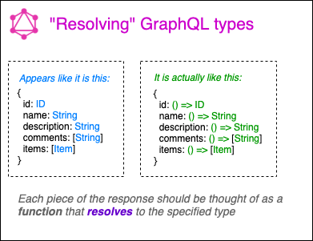
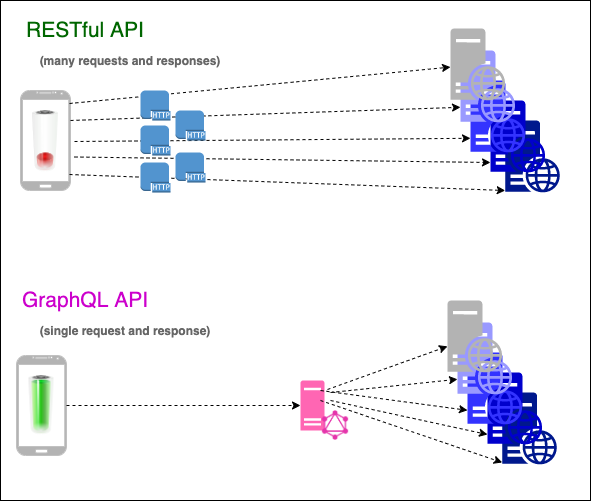
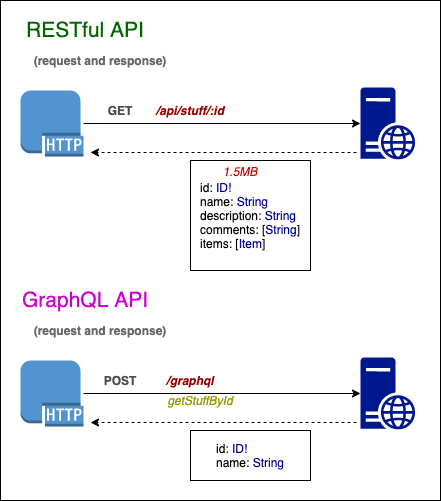

# GraphQL In Action

* What Problem is GraphQL Trying to Solve?
* Fast overview of an exciting ecosystem

## Resolvers

In the world of GraphQL one of the words you will encounter most frequently is "resolver". Whenever speaking of a strongly-typed schema - such as you will _always_ have in any GraphQL API - a resolver simply means the way the specified schema type is fulfilled.



API consumers are used to thinking of an endpoint as providing a specified piece of JSON (or sometimes a different response type), so it is understandable to see a GraphQL "type" and equate that with the GraphQL response. There is however, another step in the process of providing that "type" as the response to the GraphQL query/mutation. The best way to thinking of an object listed as the response to a GraphQL query is each and every field in the response is either an automatic or custom function that _resolves_ to the specified field type.

A GraphQL resolver is an asynchronous function in which any database call(s), external API call(s), computation, extended security checking (ie role/permission/scope verification), or any other imaginable piece of logic may execute before returning a value.

The reason why this difference in thought is necessary is those new to GraphQL often to looking for answers to their question of "how do I do `<fill_in_the_blank_thing>` in GraphQL, and when they come up with little/no info they assume GraphQL has severe limitations. However, quite often their fundamental stumbling block is failing to grasp this concept that every field on a payload/type/response (whatever you want to call it) can be a custom function where you can do _anything_ you can possibly imagine necessary to return the value of the specified type.

```json
{
  "id": 12345,
  "name": "Lee Byron", // This value was the result of simply joining the `first_name` and `last_name` from the database record
  "taxStatus": "exempt", // This value was only resolved after verifying the access token in the header contained the necessary permission to view the person's tax status
  "taxesDue": 12003.47 // This value represents a local database lookup followed by an external API call to retrieve the current tax rate for the state of California and then calculating that against the employee's gross pay minus the amount of taxes already paid
}
```

## Consolidating API Calls

Whether you have a single GraphQL server presiding over all datasources (directly) or a single GraphQL gateway that stiches together many microservices into a single schema, there is one location to retrieve or make changes to your data. Additionally, - as an API consumer - you can put multiple queries/mutations together into fewer (or just one) request(s).



Network requests come at a cost to consumers: the more requests you make the more drain on a device's battery. Http requests are also fraught with overhead that slow down what would be an otherwise direct process of getting the data you need. If instead we can consolidate data at a single API and (if needed) bundle our requests together, this has a direct performance improvement to consumers. Fewer requests means less drain on the batter, less low-level processing of each HTTP response.

## Selection field set

Most GraphQL queries will have a structured JSON response whose individual fields you can select or omit. This is one of the biggest advantages to GraphQL server: limiting the size of an HTTP response.



Quite often API consumers need only a portion of the HTTP response, yet they receive _everything_ that endpoint provides. The excess is discarded and the pieces needed are used. This waste comes at a cost: larger network requests means longer wait time for web/mobile/iOT devices.

With GraphQL servers you instead will select all the fields you wish to receive in the HTTP response, potentially decreasing the size of the response and cutting down on the latency of your application.

# Resources

* [Personal knowledgebase (Trello) with tons of curated info](https://trello.com/invite/b/GsYWdbTl/e662bbeca0c0d251b81dac0389d3edc8/knowledgebase) - Dedicated "swimlane" for GraphQL content
* [Standalone GraphiQL editor](https://github.com/prisma-labs/graphql-playground/releases) - This is one of the most feature-rich implementations of a GraphQL query editor
* [Using Query variables in GraphQL](https://medium.com/atheros/graphql-quick-tip-how-to-pass-variables-into-a-mutation-in-graphiql-23ecff4add57)
* [GraphQL (in Python) using Graphene!](https://graphene-python.org/)
* [Graphqurl](https://github.com/hasura/graphqurl) - A CLI you can point at any GraphQL endpoint (supporting introspection) and make interactive `curl`-like requests
* [Building a microservice API Gateway with GraphQL](https://tech.iheart.com/building-a-microservice-api-gateway-for-iheartradios-radio-station-network-with-graphql-5f9ddb37a314)
* [Apollo Federation](https://blog.apollographql.com/apollo-federation-f260cf525d21) - An architecture for building a distributed miroservices graph
* [A summary of GraphQL technologies and how they can fit together (2017)](https://blog.apollographql.com/the-graphql-stack-how-everything-fits-together-35f8bf34f841) - A bit older of an article, but useful to know the evolutionary path
* [Mocking your GraphQL service with Faker.js](https://dev.to/yvonnickfrin/mock-your-graphql-server-realistically-with-faker-js-25oo)
* [Swagger UI](https://swagger.io/tools/swagger-ui/) - The OpenAPI attempt to address some of the problems GraphQL was built to solve
* [Lint your GraphQL queries with `eslint-plugin-graphql`](https://github.com/apollographql/eslint-plugin-graphql) - from the client
* [Linting rules for the schema](https://github.com/cjoudrey/graphql-schema-linter) -  from the server
* [Securing your GraphQL API](https://blog.apollographql.com/securing-your-graphql-api-from-malicious-queries-16130a324a6b)
* [Optimizing GraphQL Queries with DataLoader](https://spin.atomicobject.com/2017/05/15/optimize-graphql-queries/)
* [Combining GraphQL with Neo4J](https://blog.grandstack.io/five-common-graphql-problems-and-how-neo4j-graphql-aims-to-solve-them-e9a8999c8d43)
* [Custom schema directives](https://blog.grandstack.io/authorization-in-graphql-using-custom-schema-directives-eafa6f5b4658) - Focuses on auth related concerns
* [PersistGraphQL](https://github.com/apollographql/persistgraphql) - Protecting the queries from introspection (ie, query "whitelisting" between approved clients and the server)
* [Automatic Persisted Queries](https://www.apollographql.com/docs/apollo-server/performance/apq/) - Send hashes (represnting GraphQL queries) rather than the whole serialized AST in the GraphQL request
* [Performance monitoring with Apollo Tracing](https://blog.apollographql.com/exposing-trace-data-for-your-graphql-server-with-apollo-tracing-97c5dd391385)
* [Depth-limiting GraphQL queries](https://github.com/stems/graphql-depth-limit)
* [Number limiting](https://github.com/joonhocho/graphql-input-number) - Useful if you want to make sure someone doesn't try to grab 10,000 rows in your paginated query
* [Query cost analysis](https://github.com/pa-bru/graphql-cost-analysis)
* [Error tracking (also with Apollo Tracing)](https://blog.apollographql.com/apollo-engine-and-graphql-error-tracking-e7dd3ce8b99d)
* [CLI for GraphQL development](https://github.com/Urigo/graphql-cli)
* [Generate boilerplate and bootstrap a GraphQL server from your types alone](https://graphback.dev/docs/gettingstarted)
* [Separating a GraphQL across multiple APIs](https://www.youtube.com/watch?v=DRdnGtW5AcM&feature=youtu.be)
* [Apollo VSCode extension](https://marketplace.visualstudio.com/items?itemName=apollographql.vscode-apollo)
* [a list of "Awesome GraphQL Tools"](https://github.com/chentsulin/awesome-graphql#tools)
